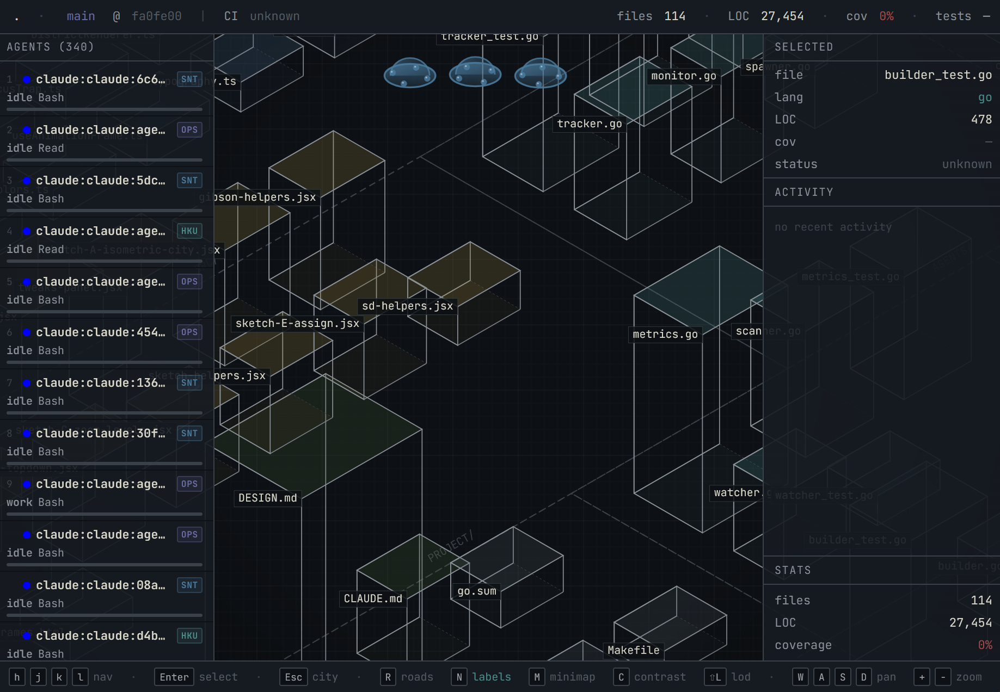

# Agent City

[](LICENSE)

Manage AI coding agents like a SimCity mayor. Buildings are files, districts are directories, UFO agents are your running Claude/Codex/Gemini sessions.



## Quick Start

```bash
git clone <repo> && cd agent-city
make dev          # start frontend dev server (http://localhost:5173)
make run          # start Go backend (http://localhost:8080)
```

Open `http://localhost:5173` and point it at a repo.

## Keyboard Shortcuts

| Key | Action |
|-----|--------|
| `←` `→` `↑` `↓` | Pan city |
| `+` / `-` | Zoom in / out |
| `Tab` | Cycle through active agents |
| `Enter` | Focus selected agent |
| `Esc` | Deselect / close panel |
| `R` | Recenter view |
| `?` | Toggle help |

## Stack

Go backend · React + Canvas frontend · [agentwatch](https://github.com/mrf/agentwatch) for agent detection
